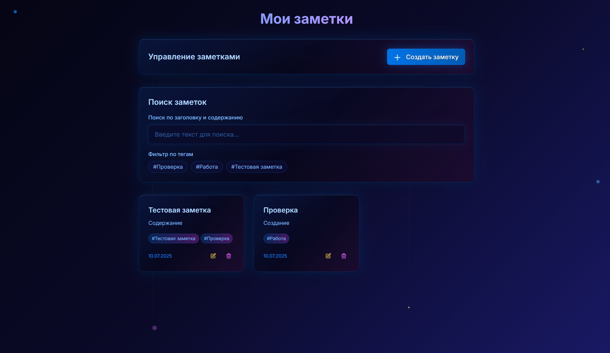

# 📝 Приложение "Заметки" на SvelteKit

Веб-приложение для создания и управления заметками, построенное с использованием SvelteKit, TypeScript и Tailwind CSS.

## 📸 Скриншоты интерфейса

### Главная страница приложения


### Интерфейс создания заметки


## 🚀 Технологии

- **SvelteKit** ^1.30.4 - основной фреймворк
- **TypeScript** ^5.3.3 - полная типизация
- **Tailwind CSS** ^3.4.0 - стилизация с кастомными цветами
- **Dexie** ^3.2.4 - локальное хранение (IndexDB)
- **Vite** ^4.5.1 - сборщик

## ✨ Основные функции

### ✅ Реализованные функции:

- **Создание заметок** - заголовок (до 100 символов), содержимое (до 5000 символов), теги
- **Просмотр списка заметок** - с датами создания и обновления
- **Поиск заметок** - по заголовку и содержимому в реальном времени
- **Фильтрация по тегам** - быстрый доступ к заметкам по категориям
- **Редактирование заметок** - полное редактирование всех полей
- **Удаление заметок** - с подтверждением действия
- **Локальное хранение** - все данные сохраняются в IndexDB
- **Адаптивный дизайн** - работает на всех устройствах
- **Анимации и эффекты** - плавные переходы и hover-эффекты
- **Сортировка** - по дате создания (новые сверху)

### 🎨 Дизайн:

- **Цветовая схема**
- **Анимации**
- **Градиенты**: многослойные фоны с эффектом глубины
- **Интерактивность**: hover-эффекты, масштабирование кнопок
- **Киберпанк атмосфера**: темная тема с яркими акцентами

## 🏗️ Структура проекта

```
src/
├── lib/
│   ├── components/     # Svelte компоненты
│   ├── stores/         # Svelte stores для состояния
│   ├── types/          # TypeScript интерфейсы
│   └── db/             # Конфигурация базы данных
├── routes/             # Страницы приложения
├── app.css            # Глобальные стили
└── app.html           # HTML шаблон
```

## 🛠️ Установка и запуск

### Предварительные требования:

- Node.js >= 18.12.1
- npm или yarn

### Установка:

```bash
# Установка зависимостей
npm install

# Запуск в режиме разработки
npm run dev

# Сборка для продакшена
npm run build

# Предварительный просмотр сборки
npm run preview
```

## 🤖 Процесс работы с ИИ

Это приложение было создано в сотрудничестве с ИИ-ассистентом Claude 4 Sonnet. Процесс разработки включал:

### Этапы разработки:

1. **Планирование архитектуры** (10 мин) - определение структуры проекта и технологий
2. **Создание базовой функциональности** (30 минут) - CRUD операции, база данных
3. **Разработка интерфейса** (30 мин) - компоненты, формы, модальные окна
4. **Стилизация** (20 мин) - кастомные цвета, анимации, эффекты
5. **Тестирование** (1 час) - исправление багов
6. **Доработка пользовательского интерфейса** (1 час 20 мин) - улучшение UX
7. **Документация** (10 мин) - создание README и документации

**Общее время разработки: ~4 часа**

